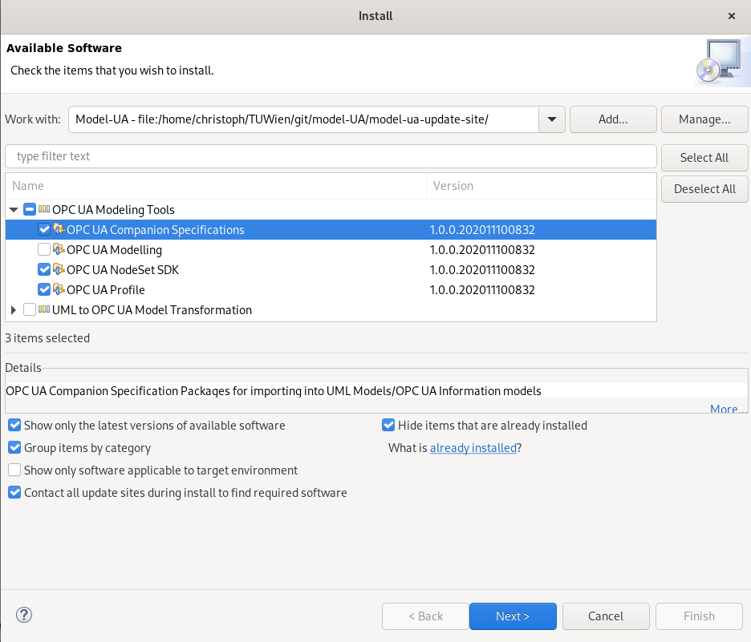
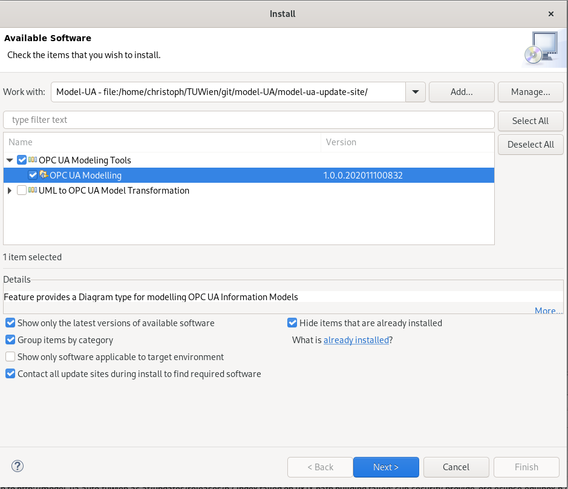

# papyrus-opcua-plugin
This project develops several features extending Eclipse Papyrus which handles modelling of OPC-UA information models.

## Prerequisites

### Papyrus
The Features reliy on an existing installation of Papyurs Eclipse Project https://www.eclipse.org/papyrus/. You can install it in Eclipse or download a optimized version from the project page https://www.eclipse.org/papyrus/download.html. The Plugin is developed using Papyrus version 2020-06.

## Installation 

### Preperation
Open Papyrus and go to Help-->Check for Updates and bring the installation up to date and restart if required.

Open Papyrus and go to Help-->Install New Software select 

### Adding Update-Site
The Plugin is provided via the model-ua update site :  https://model-ua.auto.tuwien.ac.at/updates/releases

Open Papyrus and go to Help-->Install New Software, click on Add and enter the link.

### Adding Archive as Update-Site

Alternatively the releases can be downloaded here as archives : https://github.com/model-UA/papyrus-opcua-plugin/releases 

Open Papyrus and go to Help-->Install New Software, click on Add and then on Local or Archive depending if you extracted the archive or not.

### OPC UA Modelling Features

If the last step was successful you should be able to find the following packages:

OPC UA NodeSet SDK provides the underlying functions required for reading and writing to NodeSet files.

OPC UA Profile provides a UML Profile which eases creation of OPC UA Information Models.

OPC UA Companion Specifications provides UML models of the NodeSets provided by the companion specifications.

OPC UA Modelling provides a new Diagram Type for Papyrus according to the graphical notation of the OPC UA Foundation.

### Diagram Installation 

As the dependency resolution of eclipse is not perfect the installation of the diagram has to be done in two steps.
First install 
    - OPC UA NodeSet SDK
    - OPC UA Profile
    - OPC UA Companion Specifications

Restart Papyrus and go to Help-->Install New Software and now install OPC UA Modelling:

Restart Papyrus again.

## Usage

### Creating new Models

## Development

### Depencies

#### Eclipse SDK
If you want to build or debug the plugin yourself you have to install the Eclispe SDK. This can be found in the Eclipse Project repository in the list of update sites.
Select the following items:
    - Eclipse SDK

#### Additonal Papyrus depencies

If the underlaying UML model used for the diagram shall be adapted install the following from the papyrus update site:
    - Papyrus Toolsmith Tools 
    - Papyrus Diagram Assistants Generator 

## Papyrus code generator based Transformation

This is deprecated as the programmatic aproach was not further developed, please check out https://github.com/model-UA/uml-to-opcua for more transformation aproaches. 

### Prerequisites

#### Install Designer Plugins
The Plugin depends on the availabillity of Papyrus Code Generators, therefore some Papyrus Designer Plugins need the be installed.
Add the following update Site to Papyrus: http://download.eclipse.org/modeling/mdt/papyrus/components/designer/
Then install the following items
- Papyrus base elements for code generation

#### Installing the Plugin 
Download the .jar files from the latest release and drop them into the plugins folder of your Papyrus installation. 
Current Release https://github.com/model-UA/papyrus-opcua-plugin/releases/tag/v0.0.1-beta1 

### Using the Plugin

Currently the Plugin only supports transformation of Class Diagrams and no output of errors. Errornous entries will be ignored.
A Information Model can be generated by right clicking into a Diagram and selcting the Menu entry Designer->Generate OPC-UA Information Model 

#### Error Logging
Not everything which is modelled in UML can be transformed into OPC-UA information models. Transformation Errors will be shown insided the Error Log of Papyrus which can be shown via Window->Show View->Error Log. Each log entry shows the qualified name of the UML and what the error is. 

### Debugging the Plugin
With the source code the plugin can debugged inside the Papyrus installation.

#### Loading the the Plugin
First the following folders have to imported as Eclipse Project into the Workspace. 
 - org.eclipse.papyrus.designer.languages.opcua.codegen
 - org.eclipse.papyrus.designer.languages.opcua.codegen.ui

Finally run or debug as Eclipse Application. 
