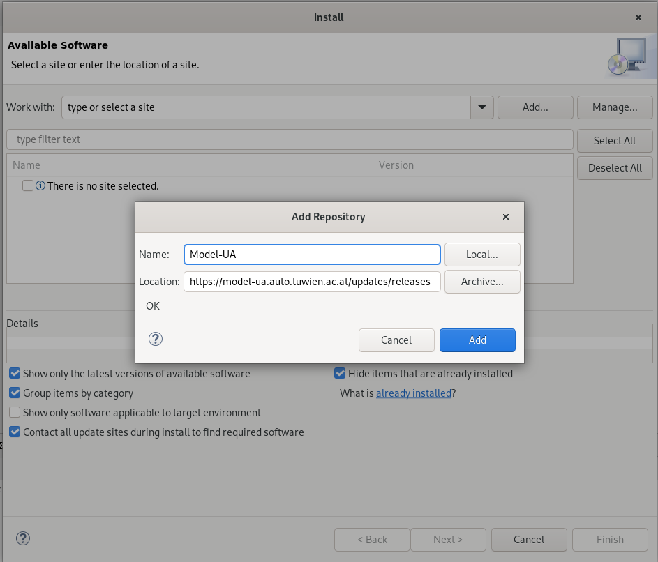
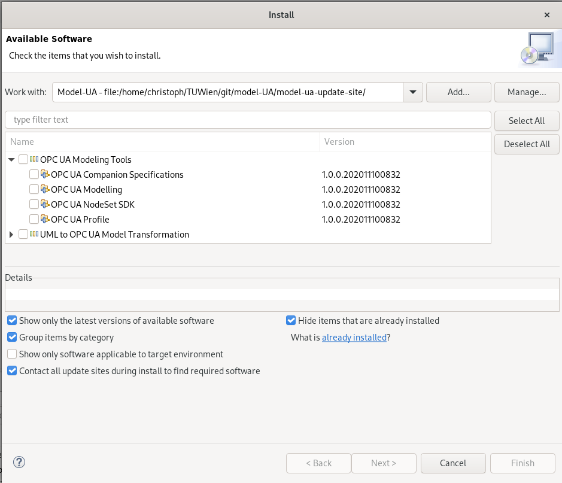
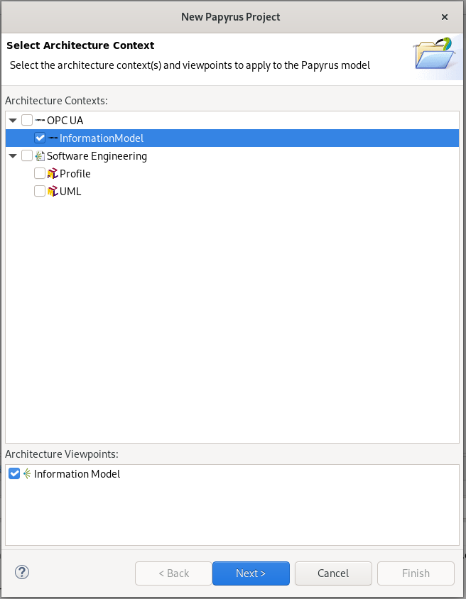
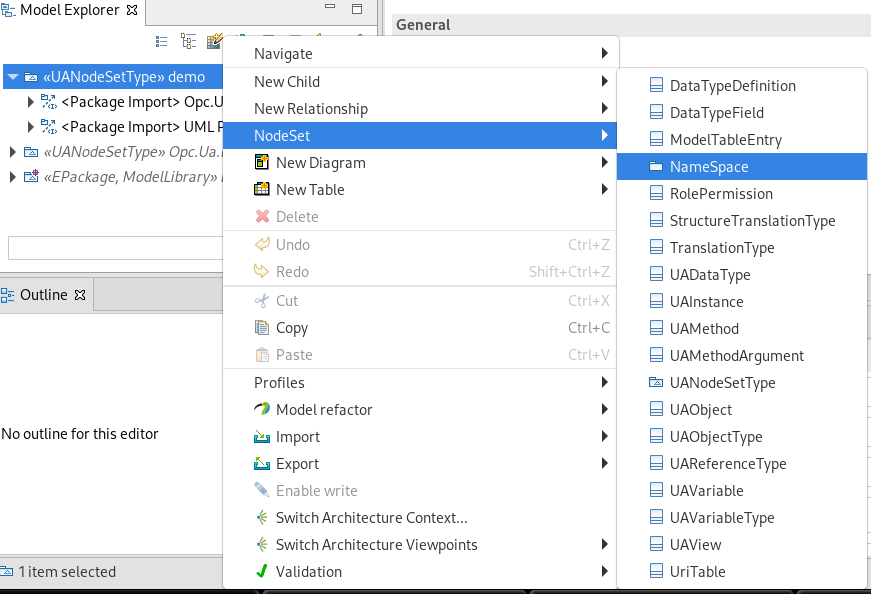
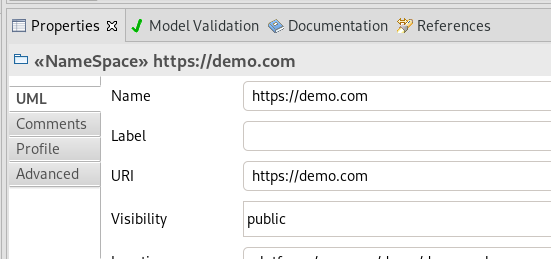
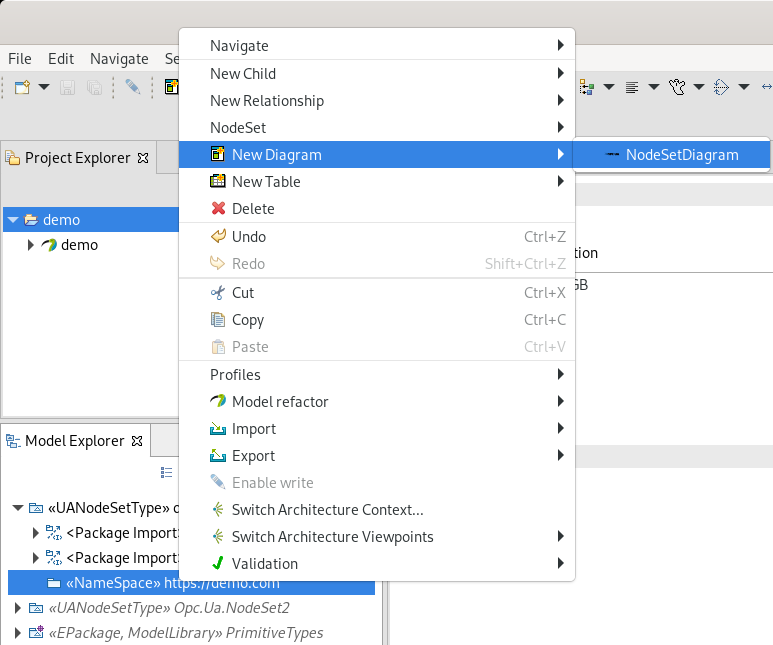
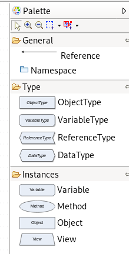
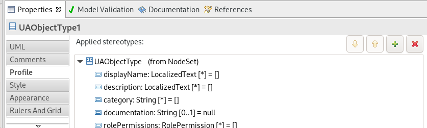
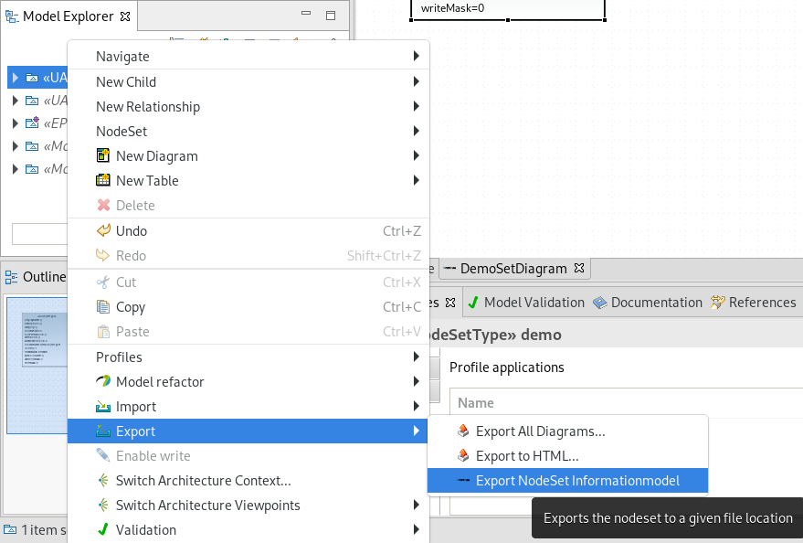

# papyrus-opcua-plugin
This project develops several features extending Eclipse Papyrus which handles modelling of OPC-UA information models.

## Prerequisites

### Papyrus
The Features reliy on an existing installation of Papyurs Eclipse Project https://www.eclipse.org/papyrus/. You can install it in Eclipse or download a optimized version from the project page https://www.eclipse.org/papyrus/download.html. The Plugin is developed using Papyrus version 2020-06.

## Installation 

### Preperation
Open Papyrus and go to Help-->Check for Updates and bring the installation up to date and restart if required.

Open Papyrus and go to Help-->Install New Software select 

### Adding Update-Site
The Plugin is provided via the model-ua update site :  https://model-ua.auto.tuwien.ac.at/updates/releases

Open Papyrus and go to Help-->Install New Software, click on Add and enter the link.

### Adding Archive as Update-Site

Alternatively the releases can be downloaded here as archives : https://github.com/model-UA/papyrus-opcua-plugin/releases 

Open Papyrus and go to Help-->Install New Software, click on Add and then on Local or Archive depending if you extracted the archive or not.

### OPC UA Modelling Features

If the last step was successful you should be able to find the following packages:

OPC UA NodeSet SDK provides the underlying functions required for reading and writing to NodeSet files.

OPC UA Profile provides a UML Profile which eases creation of OPC UA Information Models.

OPC UA Companion Specifications provides UML models of the NodeSets provided by the companion specifications.

OPC UA Modelling provides a new Diagram Type for Papyrus according to the graphical notation of the OPC UA Foundation.

### Diagram Installation 

To get the OPC UA Modelling option inside Papyrus install the following packages:
    - OPC UA NodeSet SDK
    - OPC UA Profile
    - OPC UA Companion Specifications
    - OPC UA Modelling

When the installation is done restart Papyrus.

## Usage

### Creating new Models

When creating a new Model select the Architecture Context OPC UA/Informationmodel:

As the tool does not automatically generate any namespaces it's better to create the Diagrams itself later. When clicking on finish, it may take a minute until the new model is initialized and the namespace 0 elements are loaded.

### Start Modelling
The first step which should be done is creating a namespace, this can be done by right clicking on the root element of your model in the Model Explorer. In the now opened context menu there is a entry NodeSet and in there is an entry Namespace. 

After creating the namespace, the URI can be set inside the propoerties tab:

The next step is to create a NodeSet Diagram by right clicking on the created namespace element inside the Model Explorer. In the context menu click on New Diagram and then on NodeSetDiagram.

On the right side of the diagram the following palette is shown. It can be used to directly drag and drop new elements into the Diagram.

Each Element can be configured in the Profile page inside the properties page. That a configuration of an UANode (UAObjectType, UAMethod,...) is valid at least the browseName and the NodeID need to be set.

For creatign Rerferences between Elements click on the Reference entry in the palette and connect the desired diagram elements. In the Profile page inside the Properties Tab, the the direction of the Reference and the desired ReferenceType can selected. By clicking on the Button with the 3 dots all available ReferenceTypes can be browsed through, including namespace 0 and all imported Namespaces. 

As the Namespace 0 is automatically loaded all elements from it can be used and draged from the Model Explorer into the diagram and used with References.

### Non-Graphical Elements#

Not all elements required for modelling are part of the Graphical notation, e.g. RolePermissions. These elements can be added via the Model Explorer, right click on an element of your model and select the desired item. Again the configuration options are in the Profile page inside the Properties tab. Afterwards the model member can be referenced in the element.

### Displaying Configuration Entries

Per default no entry of the element is displayed in the diagram, to do this select the desired object in the diagram an open the Appearance page inside the Properties tab. Scroll to Stereotype display and check the top most entry in the In Comment collumn, afterwards deselect every entry which shall not be displayed.

### Exporting the NodeSet

On every save of the model a NodeSet file will be generated in the backgraound and is stored in the project directoy. It has the same name as your model file, but with a xml file extension.

If you want to directly export your diagram to a dedicated location this can be done via Export menu of Papyrus. Right click on an Element of your model inside the Model Explorer, under Export select Export NodeSet Informationmodel. 

An export to this location can also be done automatically via the preferences. Go to Window --> Preferences and select the OPC UA page. First configure the Default Export directory and then check "Automatically generate a NodeSet file on save inside the default export directory". If the project folder shall be taken over also check "Create folder hierarchy of NodeSet file inside default export folder".  

### Importing NodeSet

There are three possibilities to import a content of a NodeSet:
    - Changing the autogenerated NodeSet file of your project
    - Importing a NodeSet Model to reference its Elemtns
    - Import a NodeSet file to update the current Model

On every save a NodeSet file corresponding to the model is generated, this NodeSet file can also be used by other applications and will be loaded if it was changed. 
R
For importing a NodeSet to use inside your model right click on an Element of your model inside the Model Explorer, under Import select Import NodeSet Informationmodel. 

## Troubleshooting

## Development

### Depencies

#### Eclipse SDK
If you want to build or debug the plugin yourself you have to install the Eclispe SDK. This can be found in the Eclipse Project repository in the list of update sites.
Select the following items:
    - Eclipse SDK

#### Additonal Papyrus depencies

If the underlaying UML model used for the diagram shall be adapted install the following from the papyrus update site:
    - Papyrus Toolsmith Tools 
    - Papyrus Diagram Assistants Generator 

## Papyrus code generator based Transformation

This is deprecated as the programmatic aproach was not further developed, please check out https://github.com/model-UA/uml-to-opcua for more transformation aproaches. 

### Prerequisites

#### Install Designer Plugins
The Plugin depends on the availabillity of Papyrus Code Generators, therefore some Papyrus Designer Plugins need the be installed.
Add the following update Site to Papyrus: http://download.eclipse.org/modeling/mdt/papyrus/components/designer/
Then install the following items
- Papyrus base elements for code generation

#### Installing the Plugin 
Download the .jar files from the latest release and drop them into the plugins folder of your Papyrus installation. 
Current Release https://github.com/model-UA/papyrus-opcua-plugin/releases/tag/v0.0.1-beta1 

### Using the Plugin

Currently the Plugin only supports transformation of Class Diagrams and no output of errors. Errornous entries will be ignored.
A Information Model can be generated by right clicking into a Diagram and selcting the Menu entry Designer->Generate OPC-UA Information Model 

#### Error Logging
Not everything which is modelled in UML can be transformed into OPC-UA information models. Transformation Errors will be shown insided the Error Log of Papyrus which can be shown via Window->Show View->Error Log. Each log entry shows the qualified name of the UML and what the error is. 

### Debugging the Plugin
With the source code the plugin can debugged inside the Papyrus installation.

#### Loading the the Plugin
First the following folders have to imported as Eclipse Project into the Workspace. 
 - org.eclipse.papyrus.designer.languages.opcua.codegen
 - org.eclipse.papyrus.designer.languages.opcua.codegen.ui

Finally run or debug as Eclipse Application. 
